# Relatório técnico: experimento de métricas em CI/CD

## Repositório e base do projeto

- Repositório: <https://github.com/NicolasRamonm/ponderada-hermano-03-06>
- Branch do experimento: `experimento-ci-base-livre`
- Workflow YAML: <https://github.com/NicolasRamonm/ponderada-hermano-03-06/blob/experimento-ci-base-livre/.github/workflows/ci-metrics.yml>
- Projeto-base livre: [PyPA sampleproject](https://github.com/pypa/sampleproject)
- Licença do projeto-base: MIT, preservada em [`LICENSE.txt`](../LICENSE.txt)
- Descrição da adaptação: [`PROJECT_BASE.md`](../PROJECT_BASE.md)
- Script de coleta: [`scripts/collect_metrics.py`](../scripts/collect_metrics.py)
- Base CSV: [`data/pipeline_metrics.csv`](../data/pipeline_metrics.csv)
- Base JSON: [`data/pipeline_metrics.json`](../data/pipeline_metrics.json)
- Resumo por execução CSV: [`data/pipeline_run_summary.csv`](../data/pipeline_run_summary.csv)
- Resumo por execução JSON: [`data/pipeline_run_summary.json`](../data/pipeline_run_summary.json)
- Estatísticas consolidadas: [`data/pipeline_stats.json`](../data/pipeline_stats.json)
- Script de gráficos: [`scripts/generate_charts.py`](../scripts/generate_charts.py)
- Checklist de requisitos: [`reports/checklist.md`](./checklist.md)

## Hipótese inicial

A hipótese inicial foi que cache e jobs paralelos reduziriam o tempo total do pipeline, enquanto teste lento e aumento artificial da quantidade de testes elevariam principalmente o tempo do job de testes.

O resultado confirmou parcialmente essa hipótese. O cache reduziu o tempo médio de instalação, mas o tempo total continuou bastante influenciado por overhead de runner, checkout, setup de Python, upload de artefatos e variação natural do GitHub Actions. A execução com mais testes não cresceu de forma linear porque a suíte baseada no `sampleproject` ainda é muito pequena e os testes parametrizados são baratos.

## Desenho do experimento

O projeto usa Python, Pytest e Ruff. A aplicação-base está em `src/sample/` e foi adaptada do PyPA `sampleproject`, com a função `add_one`. O arquivo `experiment_config.json` controla:

- `execution_mode`: ativa jobs paralelos (`lint-parallel` e `tests-parallel`) ou job único sequencial (`quality-sequential`);
- `extra_test_cases`: aumenta artificialmente a quantidade de testes parametrizados;
- `slow_test_ms`: adiciona atraso artificial em um teste;
- `intentional_failure`: gera falha controlada;
- `cache_buster`: muda a chave do cache de dependências.

O workflow gera artefatos por job com:

- `ci_summary.json`: resumo de cenário, cache, testes e falha;
- `junit.xml`: resultado de testes;
- `step_metrics.jsonl`: duração e exit code das etapas internas.

O script `collect_metrics.py` consulta a API do GitHub Actions, baixa os artefatos e cruza os dados em CSV/JSON. Além da base detalhada por job, ele gera resumo por execução e estatísticas consolidadas.

## Execuções reais do GitHub Actions

| Ordem | Run ID | Link | Commit | Mensagem | Variação | Status | Duração | Testes | Falhas |
|---:|---:|---|---|---|---|---|---:|---:|---:|
| 1 | 27102177249 | [run](https://github.com/NicolasRamonm/ponderada-hermano-03-06/actions/runs/27102177249) | `9053999` | Adapta experimento para base livre sampleproject | `baseline-pass` | success | 36s | 9 | 0 |
| 2 | 27102184396 | [run](https://github.com/NicolasRamonm/ponderada-hermano-03-06/actions/runs/27102184396) | `1af706b` | Mede cache na base sampleproject | `baseline-cache-hit` | success | 29s | 9 | 0 |
| 3 | 27102188950 | [run](https://github.com/NicolasRamonm/ponderada-hermano-03-06/actions/runs/27102188950) | `1efa7f8` | Aumenta testes na base sampleproject | `more-tests-25` | success | 33s | 34 | 0 |
| 4 | 27102195431 | [run](https://github.com/NicolasRamonm/ponderada-hermano-03-06/actions/runs/27102195431) | `4ac8198` | Adiciona teste lento na base sampleproject | `slow-test-1500ms` | success | 33s | 9 | 0 |
| 5 | 27102200902 | [run](https://github.com/NicolasRamonm/ponderada-hermano-03-06/actions/runs/27102200902) | `ece32a4` | Registra falha controlada na base sampleproject | `controlled-failure` | failure | 36s | 9 | 1 |
| 6 | 27102206525 | [run](https://github.com/NicolasRamonm/ponderada-hermano-03-06/actions/runs/27102206525) | `db4fa62` | Restaura pipeline verde da base sampleproject | `recovery-pass` | success | 35s | 9 | 0 |
| 7 | 27102213090 | [run](https://github.com/NicolasRamonm/ponderada-hermano-03-06/actions/runs/27102213090) | `055a33e` | Altera cache da base sampleproject | `cache-bust` | success | 32s | 9 | 0 |
| 8 | 27102218632 | [run](https://github.com/NicolasRamonm/ponderada-hermano-03-06/actions/runs/27102218632) | `3054ba3` | Compara modo sequencial na base sampleproject | `sequential-baseline` | success | 32s | 9 | 0 |
| 9 | 27102223129 | [run](https://github.com/NicolasRamonm/ponderada-hermano-03-06/actions/runs/27102223129) | `f3eedcf` | Combina sequencial e teste lento na base sampleproject | `sequential-slow` | success | 38s | 9 | 0 |
| 10 | 27102228786 | [run](https://github.com/NicolasRamonm/ponderada-hermano-03-06/actions/runs/27102228786) | `de16176` | Aumenta carga paralela na base sampleproject | `parallel-more-tests-60` | success | 35s | 69 | 0 |
| 11 | 27102235236 | [run](https://github.com/NicolasRamonm/ponderada-hermano-03-06/actions/runs/27102235236) | `cb7ba4e` | Reaproveita cache da base sampleproject | `cache-hit-after-bust` | success | 34s | 9 | 0 |
| 12 | 27102240744 | [run](https://github.com/NicolasRamonm/ponderada-hermano-03-06/actions/runs/27102240744) | `a6c1042` | Finaliza série da base sampleproject | `final-green` | success | 37s | 19 | 0 |

## Commits usados

| Commit | Mensagem | Variação |
|---|---|---|
| `9053999` | Adapta experimento para base livre sampleproject | `baseline-pass` |
| `1af706b` | Mede cache na base sampleproject | `baseline-cache-hit` |
| `1efa7f8` | Aumenta testes na base sampleproject | `more-tests-25` |
| `4ac8198` | Adiciona teste lento na base sampleproject | `slow-test-1500ms` |
| `ece32a4` | Registra falha controlada na base sampleproject | `controlled-failure` |
| `db4fa62` | Restaura pipeline verde da base sampleproject | `recovery-pass` |
| `055a33e` | Altera cache da base sampleproject | `cache-bust` |
| `3054ba3` | Compara modo sequencial na base sampleproject | `sequential-baseline` |
| `f3eedcf` | Combina sequencial e teste lento na base sampleproject | `sequential-slow` |
| `de16176` | Aumenta carga paralela na base sampleproject | `parallel-more-tests-60` |
| `cb7ba4e` | Reaproveita cache da base sampleproject | `cache-hit-after-bust` |
| `a6c1042` | Finaliza série da base sampleproject | `final-green` |

## Gráficos

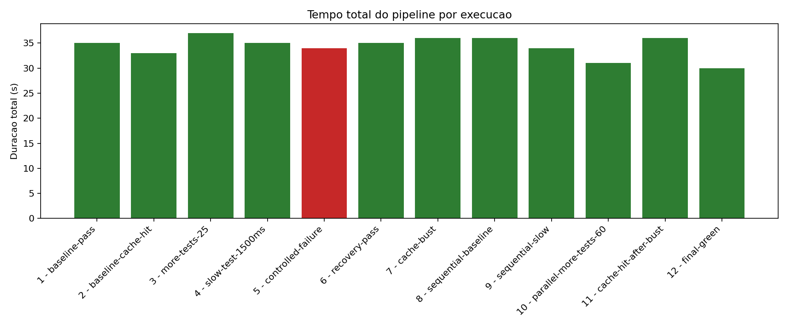

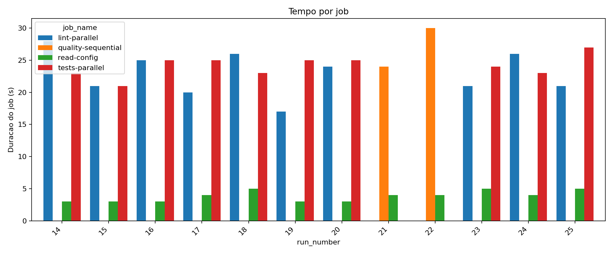

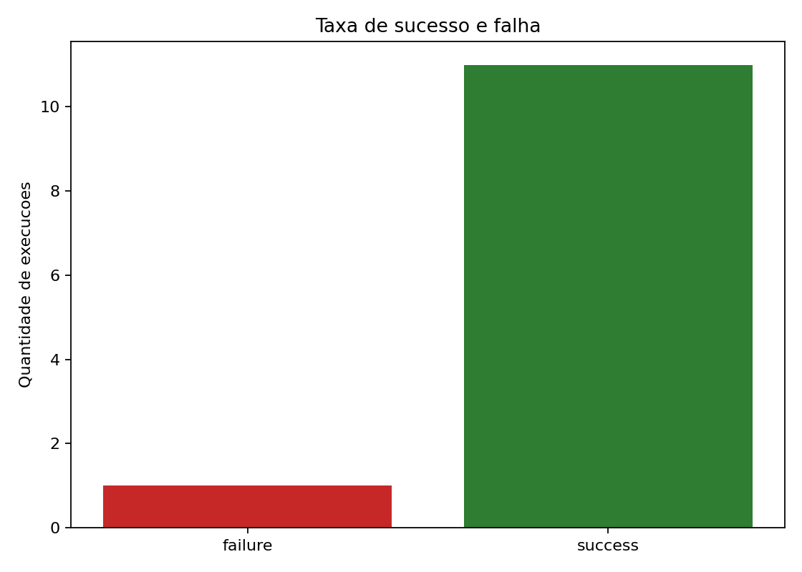

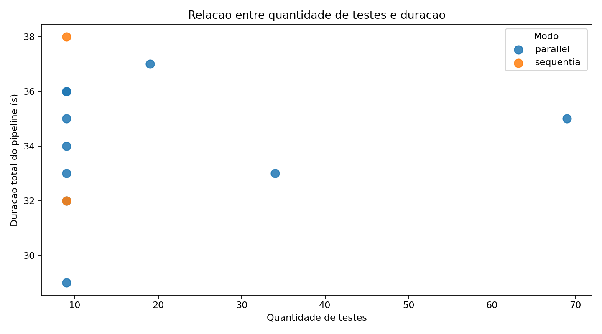

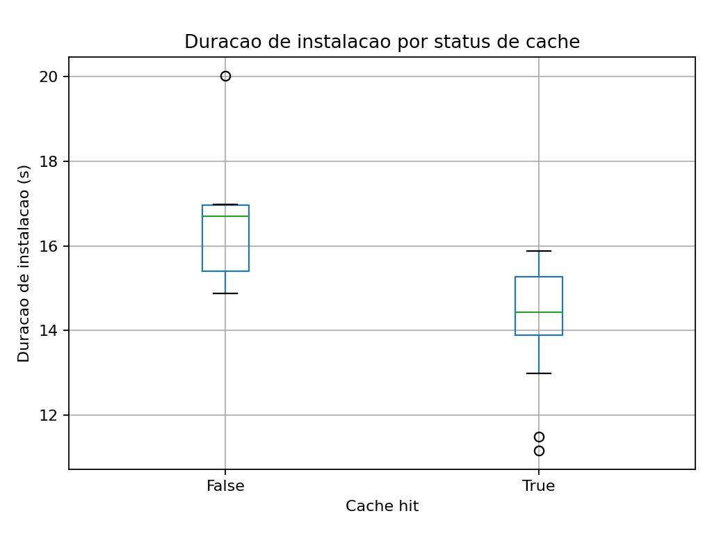

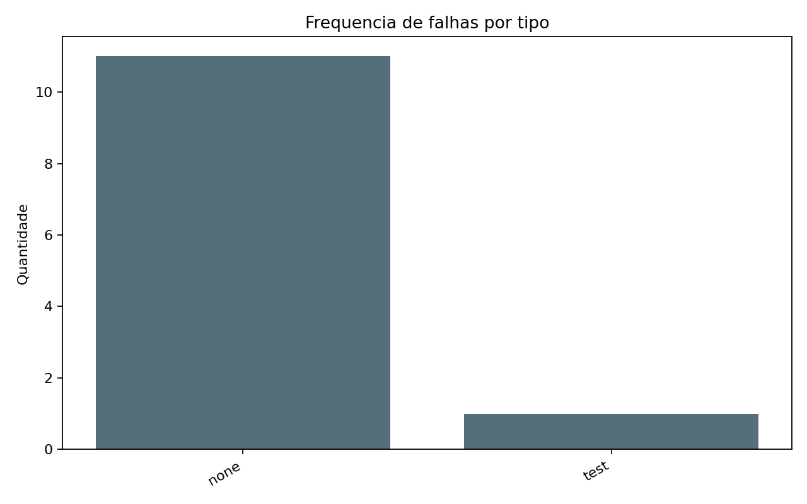

Gráficos adicionais:

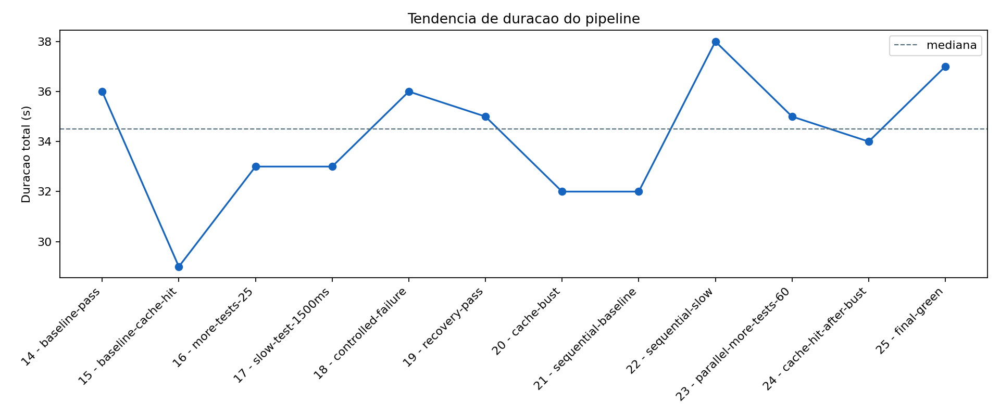

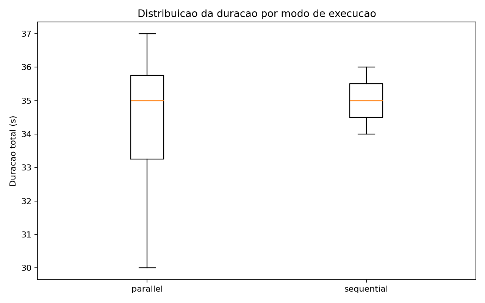

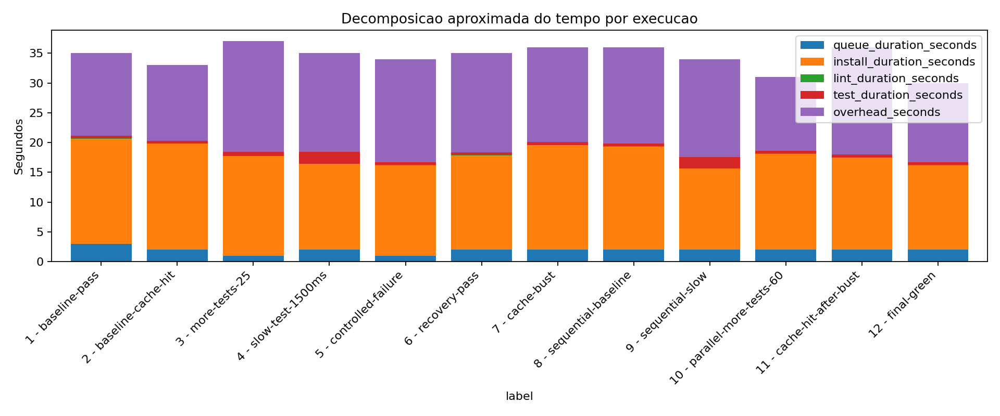

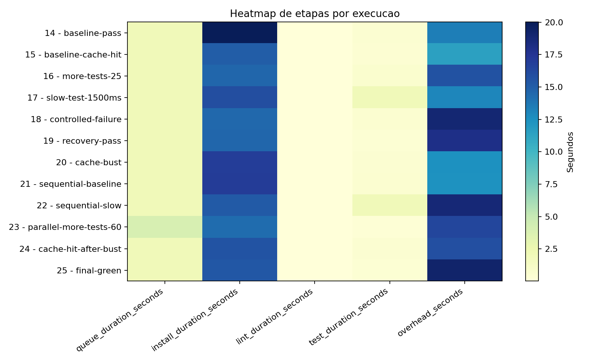

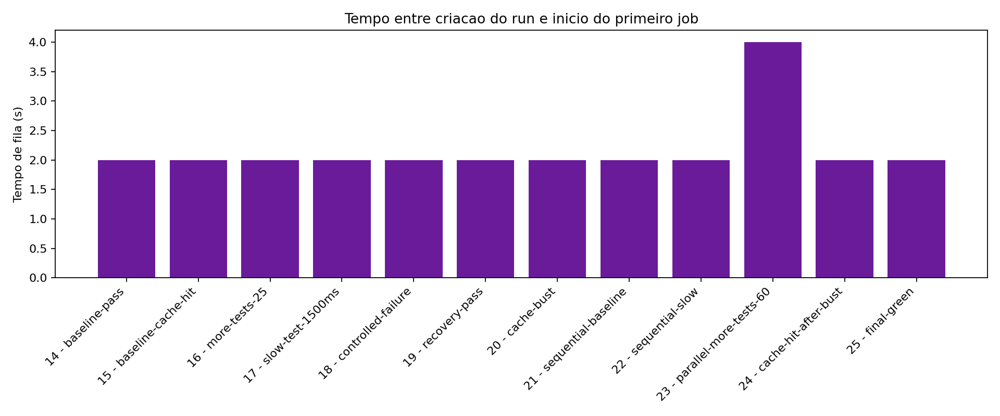

## Resultados quantitativos

- Foram 12 execuções reais: 11 com sucesso e 1 com falha.
- A única falha foi do tipo `test`, causada por `intentional_failure=true`.
- O tempo total variou de 29s a 38s.
- A duração teve p50 de 34,5s, p90 de 36,9s e p95 de 37,45s.
- O tempo de fila variou de 2s a 4s, com p50 de 2s.
- O lead time entre commit e conclusão variou de 32s a 41s.
- O lead time teve p50 de 37,5s, p90 de 39,9s e p95 de 40,45s.
- A instalação de dependências foi a etapa dominante: média de 14,90s.
- Lint foi praticamente desprezível: média de 0,03s.
- Testes tiveram média de 0,76s, com maior impacto no cenário lento.
- Sem cache, a instalação levou em média 16,72s; com cache, 14,21s.
- Execuções paralelas tiveram média de 34,0s; sequenciais, 35,0s.
- A tentativa até voltar a verde após falha foi de 2 execuções: `controlled-failure` e `recovery-pass`.

## Análise das perguntas

### Qual etapa mais contribuiu para o tempo total?

A instalação de dependências foi a etapa que mais contribuiu para o tempo total. Mesmo com a base `sampleproject` sendo pequena, o projeto instala dependências de execução e de desenvolvimento, e essa etapa ficou muito acima do tempo de lint e testes.

### Houve diferença significativa entre execuções com e sem cache?

Sim na etapa de instalação, mas com impacto limitado no workflow completo. A média de instalação caiu de 16,72s sem cache para 14,21s com cache. A economia aproximada de 2,51s é relevante, mas parte do tempo total vem de overhead externo do GitHub Actions.

### O paralelismo reduziu o tempo total? Em que condições?

O paralelismo reduziu pouco. A média paralela foi 34,0s e a sequencial foi 35,0s. O ganho é limitado porque os jobs paralelos repetem checkout, setup e instalação. Em projetos maiores, paralelismo tende a compensar quando lint/testes são mais demorados do que o custo duplicado de setup.

### Quais falhas foram mais frequentes?

Apenas uma falha ocorreu, do tipo `test`, planejada no commit `ece32a4` com a variação `controlled-failure`.

### O pipeline fornece feedback rápido o suficiente?

Sim para um projeto pequeno. O tempo de workflow ficou entre 29s e 38s, e o lead time entre 32s e 41s. Para um projeto real maior, o principal risco seria o crescimento da instalação de dependências e a repetição dessa etapa em jobs paralelos.

### Que melhorias poderiam ser feitas?

- Evitar repetir instalação de dependências em jobs paralelos.
- Criar uma imagem base ou ambiente pré-construído para reduzir setup.
- Aumentar a quantidade de execuções para comparar percentis com mais confiança.
- Separar métricas de overhead do GitHub Actions e métricas de comandos internos.
- Incluir falhas de lint e falhas de instalação como categorias adicionais.
- Adicionar cobertura de testes e publicar relatório HTML como artefato.

### Quais limitações existem nos dados coletados?

- A amostra tem 12 execuções, suficiente para a atividade, mas pequena para estatística robusta.
- Os runners do GitHub Actions são compartilhados e podem variar.
- Os commits foram enviados em sequência rápida, o que pode influenciar cache e concorrência.
- O tempo economizado com cache é estimado por diferença de instalação.
- A base `sampleproject` é propositalmente pequena, então testes não representam uma aplicação grande.
- Há apenas 2 execuções sequenciais, limitando a comparação contra paralelo.

### Como essa análise apoia decisões de engenharia?

A análise mostra que, nesta base, otimizar testes não traria grande retorno inicial, pois a etapa dominante é instalação. Uma equipe deveria priorizar cache, reduzir dependências, evitar setup duplicado e acompanhar percentis de duração antes de ampliar paralelismo ou matriz de versões.

## Resultados inesperados

1. O cenário `baseline-cache-hit` foi o run mais rápido, com 29s, abaixo do baseline de 36s. O ganho foi maior do que a economia média de cache sugeriria, indicando influência de overhead externo e variação de runner.

2. O cenário `parallel-more-tests-60`, com 69 testes, levou 35s, menor que o baseline de 36s. Isso contradiz a expectativa de crescimento linear e mostra que a suíte ainda é barata diante do custo de setup.

3. O cenário `sequential-slow` foi o mais demorado, com 38s, mesmo tendo a mesma quantidade de testes do baseline. Nesse caso, o teste lento apareceu de forma mais clara porque lint e testes estavam no mesmo job sequencial.

## Comparação entre hipótese e resultado observado

A hipótese de que cache ajudaria foi confirmada na etapa de instalação. A hipótese de que paralelismo reduziria significativamente a duração foi apenas parcialmente confirmada, pois a diferença média foi pequena. A hipótese de que mais testes aumentariam o tempo total não se confirmou claramente, porque os testes gerados são simples e o overhead do CI dominou a duração.

## Incrementos além do mínimo

- Resumo agregado por execução em `pipeline_run_summary.csv` e `pipeline_run_summary.json`.
- Estatísticas consolidadas em `pipeline_stats.json`, incluindo p50, p90 e p95.
- Métrica de tempo de fila entre criação do run e início do primeiro job.
- Gráfico de tendência temporal.
- Boxplot de duração por modo de execução.
- Decomposição aproximada do tempo por etapa.
- Heatmap das etapas por execução.
- Checklist de rastreabilidade entre requisitos e evidências.

## Reprodução

```bash
python -m venv .venv
source .venv/bin/activate
python -m pip install --upgrade pip
python -m pip install -e ".[dev]"
ruff check src tests scripts
pytest -q
```

Depois de executar o workflow no GitHub Actions:

```bash
export GITHUB_TOKEN="token_com_actions_read"
python scripts/collect_metrics.py \
  --repo NicolasRamonm/ponderada-hermano-03-06 \
  --workflow ci-metrics.yml \
  --branch experimento-ci-base-livre \
  --limit 12 \
  --output data/pipeline_metrics.csv \
  --json-output data/pipeline_metrics.json \
  --summary-output data/pipeline_run_summary.csv \
  --summary-json-output data/pipeline_run_summary.json \
  --stats-output data/pipeline_stats.json \
  --download-artifacts

python scripts/generate_charts.py \
  --input data/pipeline_metrics.csv \
  --output-dir charts
```
